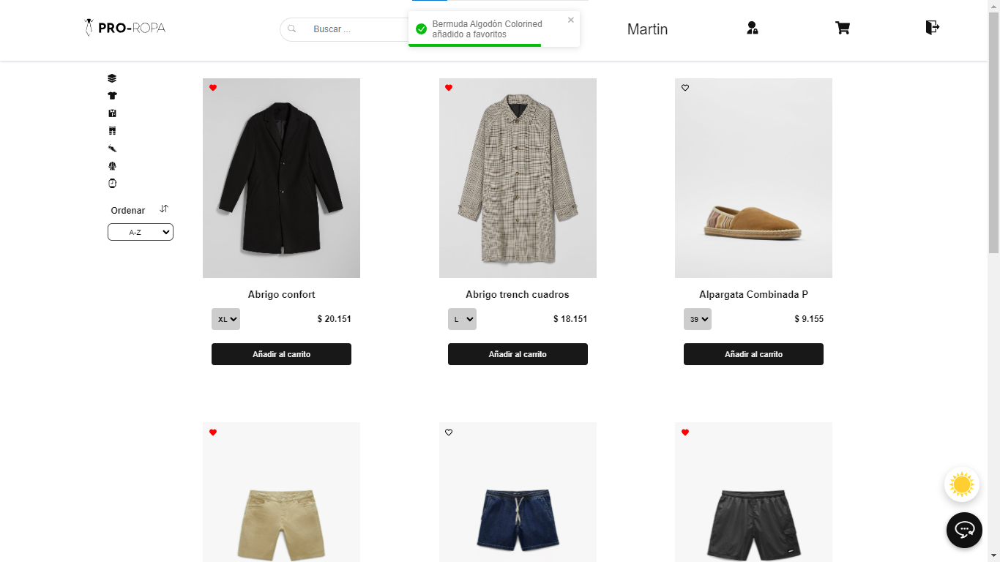
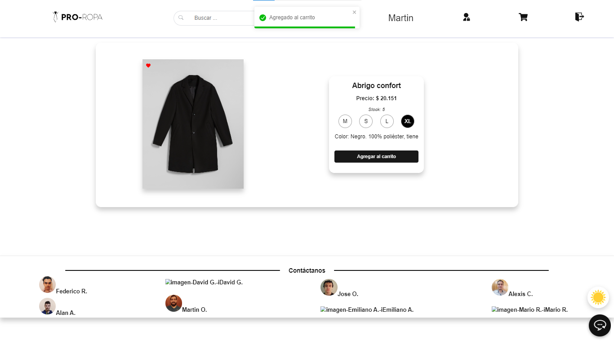
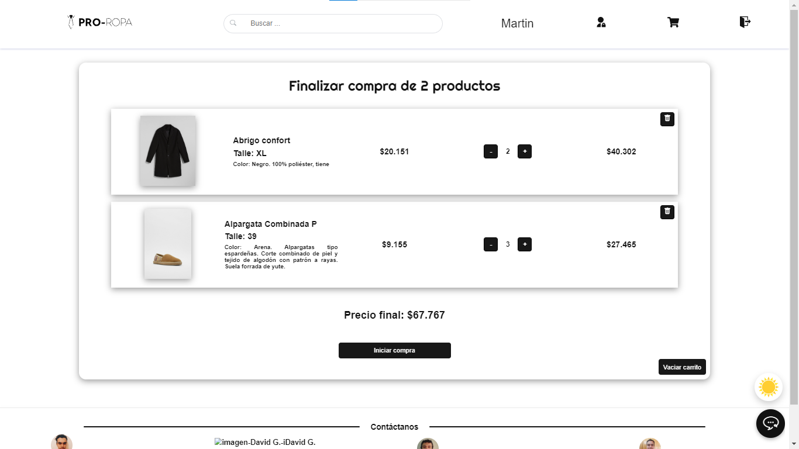
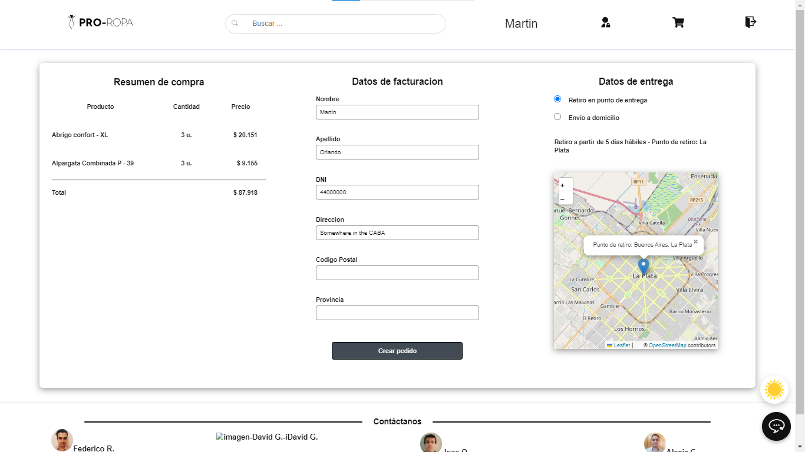
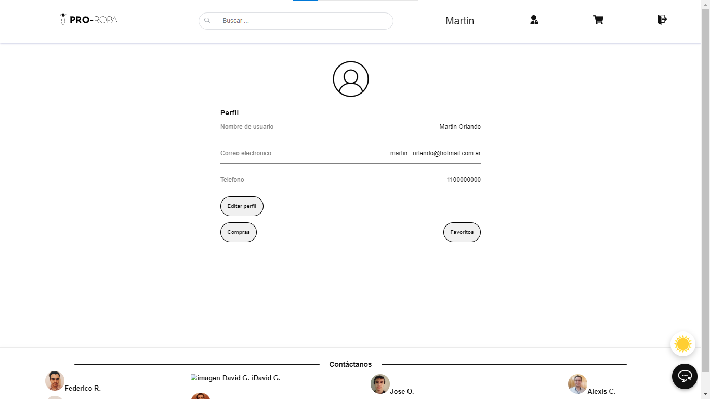
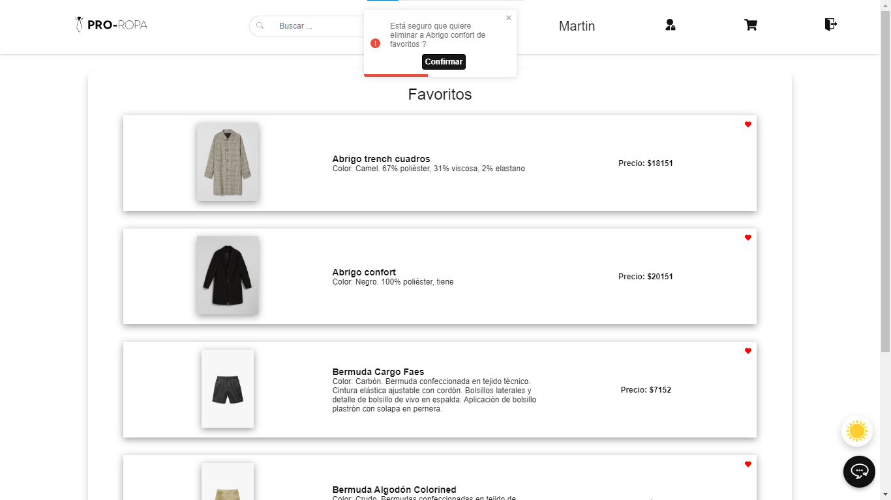
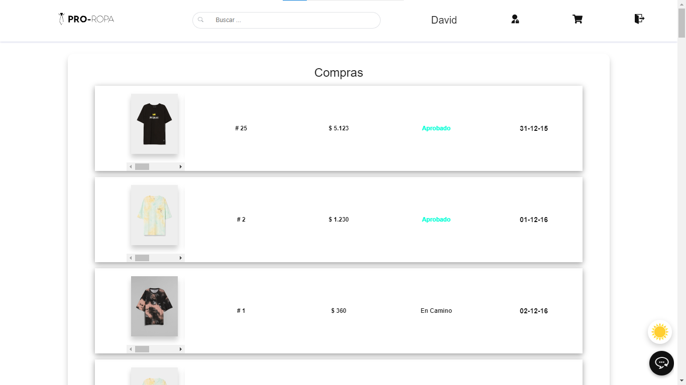
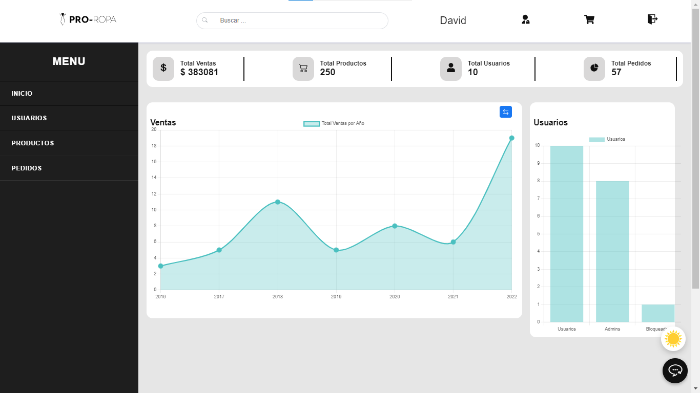

# Proyecto Final - E-Comerce
El proyecto se trata de un E-Commerce de venta de indumentaria masculina, creado de manera grupal como proyecto de evaluación final para la graduación del bootcamp "Soy Henry" como Desarrolladores Web Full-Stack

## Deploy  💻
El proyecto cuenta con un deploy activo en <a href="http://pro-ropa-store.vercel.app">link</a>

## Construido con 🛠️
- App: Vite
- Front End: React JS, Redux, Styled Components, Vercel
- Back End: NodeJS, Express, Sequelize, Heroku
- Database: PostgreSql, Heroku
- Micro Services: Mercado Pago, NodeMailer, Firebase, Cloudinary
- Agile Methodology: Scrum, Trello
- Design: figma
## Funcionalidades 💪

El sitio cuenta con todas las funcionalidades básicas de un E-Commerce. Si las describimos en función al tipo de cliente que la utiliza:

### Invitado:
- Visualización de la cartera de productos completa
- Filtrado de productos por categoría
- Ordenamiento de los mismos segun precio u nombre
- Acceso a una barra de búsqueda por nombre interactiva, la cual cuenta con una función de autocompletado
- Posibilidad de visualizar el detalle específico de cada producto y su stock remanente por talle
- Posibilidad de añadir, visualizar y eliminar del carrito de compras uno o mas productos de diversos talles
- Posibilidad de registrarse para poder contar con un usuario dentro del sitio que permita avanzar hacia la compra

### Usuario
En agregado a todas las funcionalidades que puede acceder un invitado, el usuario registrado puede:
- Ingresar por acceso directo desde google mail o con su cuenta y contraseña particular
- Acceso a un portal de perfil
- Agregar y quitar productos a favoritos, con sección para verlos y recordarlos
- Visualizar compras realizadas en el pasado y, si fueron entregadas, generar una reseña sobre alguno de los productos en el mismo
- Acceder al carrito que estaba conformando mientras tenía acceso como invitado
- Finalizar la compra, pudiendo visualizar un detalle completo y preciso de su compra
- Posibilidad de elegir entre retiro en local (a través de selección en mapa) u envío a domicilio
- Recibir mails al momento de creación de cuenta para su confirmación, posibilidad de reestablecer su contraseña si esta fue olvidada
- Recibir mails con cada actualización del estado de su pedido. Desde que se aprueba el pago hasta que es entregado
- Visualización de todos los componentes con un modo nocturno
- Acceso a un chatbot para consultas o dudas
### Administrador
El usuario que sea designado como administrador además podrá ingresar a un portal de administración con las posibilidades de:
- Visualizar estadísticas de venta
- Visualizar un listado completo de todos los productos, con la posibilidad de crear nuevos, editarlos u eliminarlos
- Otorgar permisos de administrador a otros usuarios o la posibilidad de bloquearlos para que estos no puedan ingresar nuevamente al portal con la misma dirección de mail

### Pre-requisitos 📋
Para que la api funcione es necesario crear un archivo .env en la carpeta `server` de la siguiente forma:

```env
DB_USER=usuariodepostgres
DB_NAME=database name
DB_HOST=localhost
DB_PASSWORD=passwordDePostgres
DB_PORT=database port
JWT_SECRET=secretoJWT
COOKIE_SECRET=secretoCookie

DEPLOYED=true en caso de que se este haciendo un deploy.
FRONTEND_URL=front deploy url
```

También hay que tener creada una base de datos con el nombre `ecommerce`
Una vez creado este archivo y la base de datos, se deben instalar todas las dependencias necesarias:
Mediante el uso de la terminal ingresar la carpeta server y ejecutar los comandos:
```
npm install
//una vez terminada la instalacion
npm start
```
De igual manera se debe realizar en la carpeta client para instalar las dependencias del front-end
```
npm install
//una vez terminada la instalacion
npm run dev
```

## Imágenes ✨
<p align="center">
  
  
  
  
  
  
  
  
  
  
</p>

# Colaboradores 🚶‍♂️
Imposible dejar de agradecerle a cada uno de mis compañeros. Con un fantástico trabajo en equipo formamos esta aplicación desde cero en tan solo tres semanas:
- <a href="https://www.linkedin.com/in/davigetz-developer/">David Gomez Rojas </a>
- <a href="https://www.linkedin.com/in/alan-acevedo-developer/"> Alan Acevedo </a>
- <a href="https://www.linkedin.com/in/jose-alfredo-osorio-garcia/"> Jose Alfredo Osorio García </a>
- <a href="https://www.linkedin.com/in/alexis-cortazzi-247585213/"> Alexis Cortazzi </a>
- <a href="https://www.linkedin.com/in/emiliano-arancio-083528231/"> Emiliano Arancio </a>
- <a href="https://www.linkedin.com/in/rgzrgzm/"> Mario Rodríguez </a>
